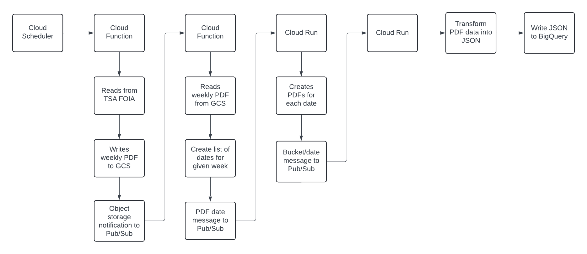
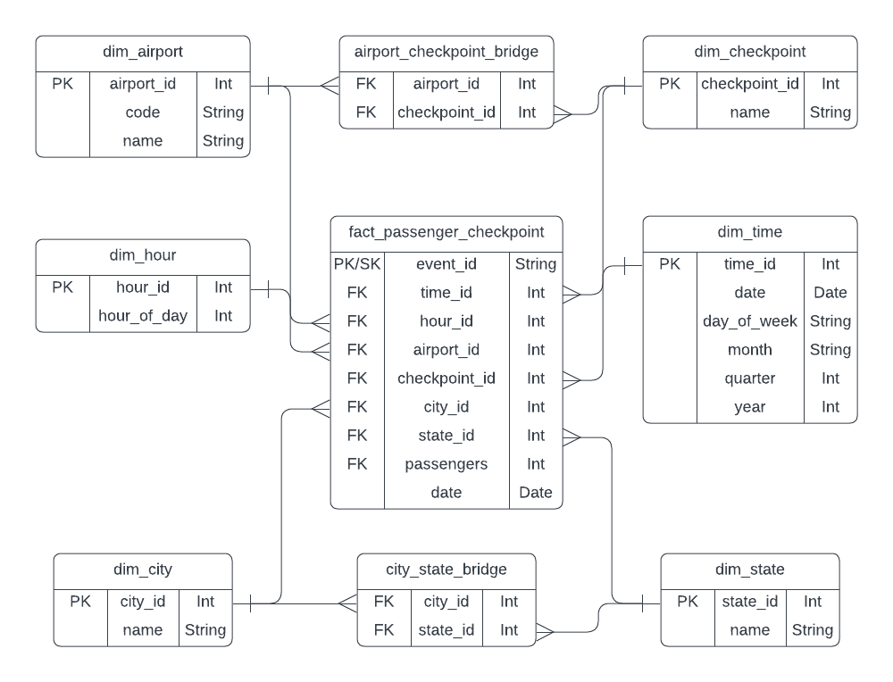

# Overview
This project is designed to automate the ingestion, transformation, and storage of Transportation Security Administration (TSA) Throughput data using a fully managed, serverless architecture on Google Cloud Platform (GCP). TSA Throughput is published on a weekly schedule [here](https://www.tsa.gov/foia/readingroom) in a PDF format. The System Workflow below describes the pipeline in more detail.

# Architecture

## Diagrams

### System Workflow

### Entity Relationship Diagram (ERD)

# Directory Structure

# Setup and Deployment

## Prerequisites
- Google Cloud account and project setup.
- Terraform installed.
- Build and deploy `create-daily-pdf` and `tsa-data-to-bigquery` container images to Google Cloud Registry.
    - Navigate to `.github/workflows` and you will find the GitHub Action file named `google-cloudrun-docker.yml`. This GH Action builds and deploys each container. In the definition of this GH Action, two repository secrets are used: `secrets.PROJECT_ID` and `secrets.GCP_CREDENTIALS`. As an example, please see the screenshot below.
    - 

## Environment Variables
- Set necessary variables in `variables.tf`.

## Configuration
1. **Terraform Initialization**
    - Navigate to the `terraform` directory and execute `terraform init`.
2. **Deployment**
    - Navigate to the `terraform` directory and execute `terraform plan`. After reviewing the output/proposed changes, execute `terraform apply`.
